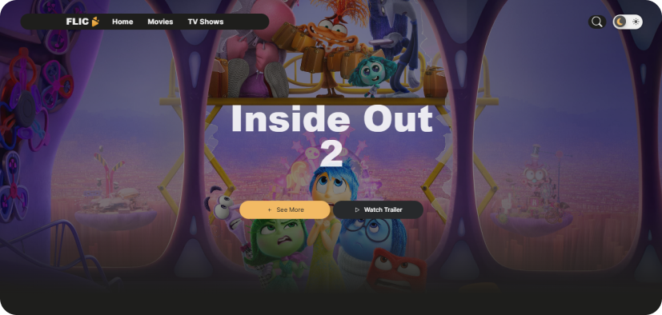

# Flic Project



## Description

Flic is a movie and series application that allows users to explore a vast catalog of content. Users can browse movies and series, view cast and crew details, and use filters to find exactly what they are looking for.

## Demo

Check out the demo [here](https://flic-lais-projects-d195e688.vercel.app/).

## Features

- Paginated navigation for movies and series
- Filters by genre and sorting
- Display of cast and crew details
- Horizontal carousel for cast navigation

## Technologies Used

- React
- Redux
- React Router
- CSS Modules
- React Select
- Infinite Scroll

## Installation

To run the project locally, follow the steps below:

1. Clone the repository:

   ```bash
   git clone https://github.com/your-username/flic.git
    ```

2. Navigate to the project directory:

   ```bash
   cd flic
    ```

3. Install dependencies:

   ```bash
   npm install
    ```

4. Start the development server:

   ```bash
   npm start
    ```

## Contribution
If you want to contribute to the project, follow these steps:

1. Fork this repository.
2. Create a branch with your feature: git checkout -b my-feature
3. Commit your changes: git commit -m 'My new feature'
4. Push to the branch: git push origin my-feature
5. Submit a Pull Request.
